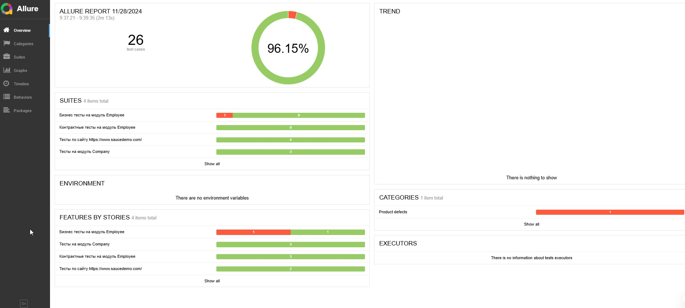
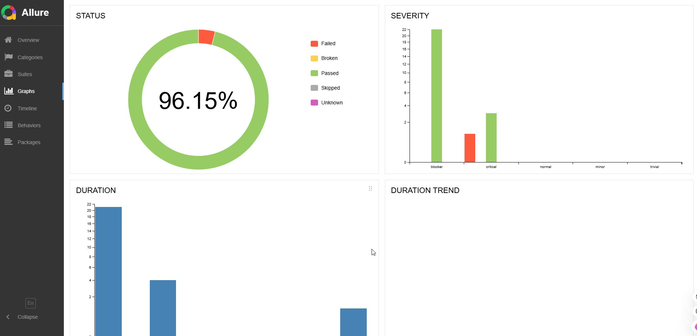
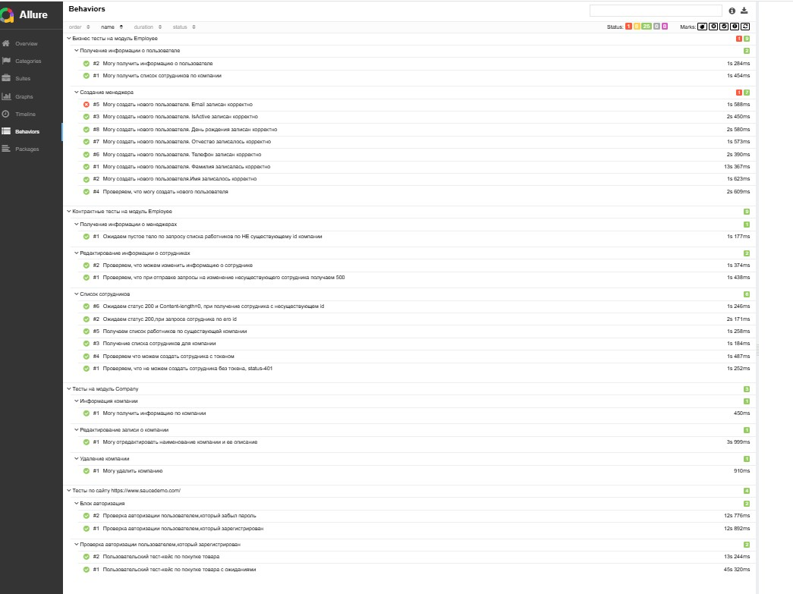
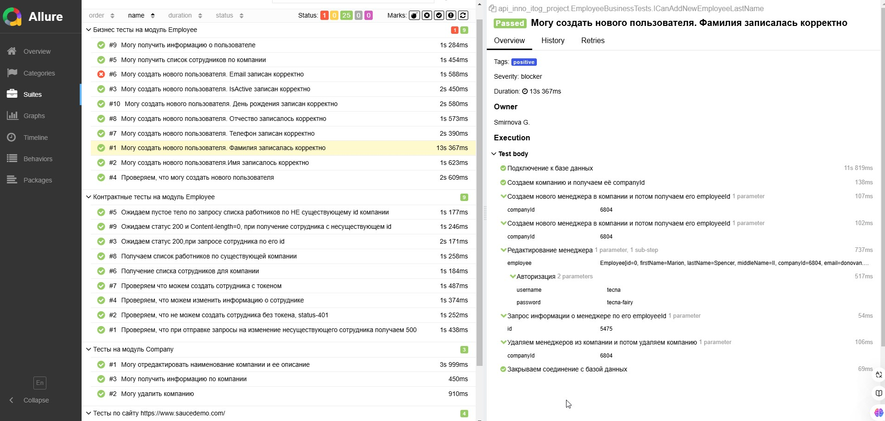
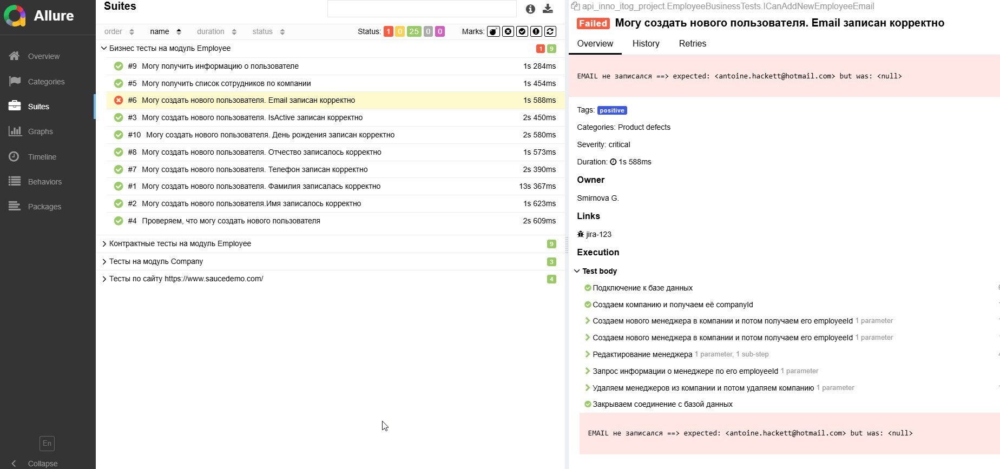
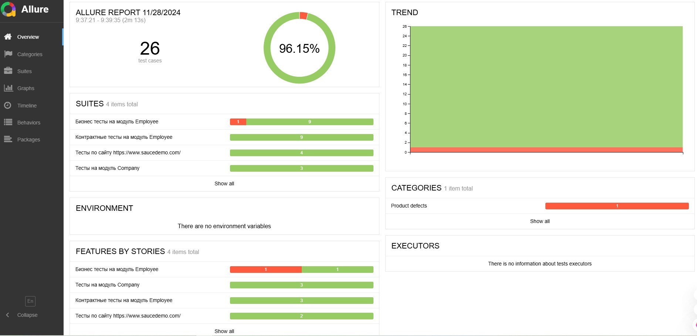

# MY FRAMEWORK
(ШАБЛОН ПРОЕКТА ПО АВТОМАТИЗИРОВАННОМУ ТЕСТИРОВАНИЮ)

## Содержит
* UI - тесты
* API - тесты
* Настройка тестов с Allure

## Описание framework
1. UI - тесты
2. API - тесты
3. Команды для запуска тестов:
 - `git clone -b main https://github.com/Bgalina86/inno_itog_project.git`
 - `mvn clean test`

4. Команды для построения отчётности в Allure
 - **allure serve** - быстрое построение отчетов без сбора статистики по предыдущим запускам
Создание отчета с учетом предыдущих запусков:
   1. Запускаем создание отчета `allure generate`. Отчет будет сохранен в директорию `allure-results`
   2. Из `allure-report` в `allure-results` тащим папку `history`
   3. Папку `allure-report` удалить
   4. `allure generate`
   5. `allure open`
 
## Отчёт по прогону в Allure
### Suites

### Graphs

### Behaviors

### Test body

### Failed

### Trend

